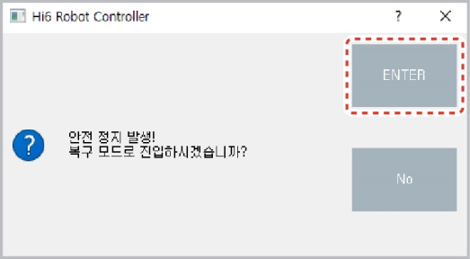
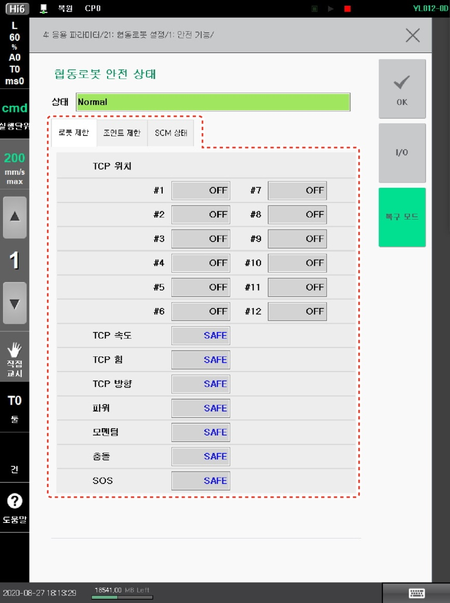

# 1.10.5 복구 모드

복구 모드에서 안전 기능 모니터링 위반으로 발생한 에러를 해제합니다. 복구 모드에서는 일시적으로 위치 검지를 수행하지 않으므로 안전 기능의 위반 여부에 관계 없이 로봇을 구동하여 로봇의 각도와 위치를 조정할 수 있습니다.

안전 기능 모니터링 위반 시, 로봇은 즉각 안전 정지를 수행하여 동작을 멈추고 작업 프로그램 화면에 안전 정지 알림창이 나타납니다.

1\. 운전 방식을 수동 모드로 설정하십시오.

2\. 안전 정지 알림창에서 **\[ENTER]** 버튼을 터치하십시오. 안전 상태 모니터링 화면이 나타납니다.

3\. **\[복구 모드]** 버튼을 터치하십시오. **\[복구 모드]** 버튼이 초록색으로 바뀌고 복구 모드로 전환됩니다.

4\. 복구 모드에서 로봇의 각도와 위치를 조정하여 에러를 해제하십시오.

5\. 복구 완료 시, **\[복구 모드]** 버튼을 터치하십시오. **\[복구 모드]** 버튼이 원래의 색으로 돌아오고 복구 모드가 해제됩니다.

* 안전 상태 모니터링 화면 우측 상단의 **\[X]** 버튼을 터치해도 복구 모드를 해제할 수 있습니다.


**\[주의]**: 복구 모드 해제 후 안전 레이아웃 설정 및 작업 프로그램의 티칭 위치를 다시 확인하십시오.

