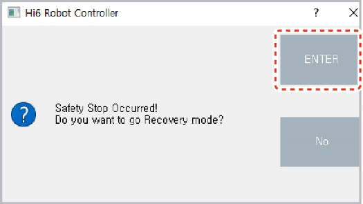

# 1.10.5 Recovery mode

In recovery mode, you can clear errors that occur because of the safety function violations during monitoring. Because position detection is temporarily disabled in recovery mode, you can drive the robot and adjust its angle and position without violating the safety functions.

If a safety function monitoring is violated, the robot will activate a safety stop immediately and stop moving. In addition, the safety stop notice window will appear on the operating program window.

1 .Set the operating mode to the manual mode.

2\. On the safety stop notice window, click the **\[ENTER]** button. Then, the safety condition monitoring window will appear.

3\. Click the **\[Status Recovery]** button. Then, the **\[Status Recovery]** button will turn green, and the system will enter recovery mode.

4\. In recovery mode, adjust the robot’s angle and position to clear errors.

.png>)

5\. After the recovery is completed, click the **\[Status Recovery]** button. Then, the **\[Status Recovery]** will turn into the previous color, and the recovery mode will be cleared.

* You can also clear the recovery mode by clicking the **\[X]** button at the upper-right corner of the safety condition monitoring window.


**\[Caution]**: After clearing the recovery mode, recheck the safety layout setting and the teaching position of the operating program.

