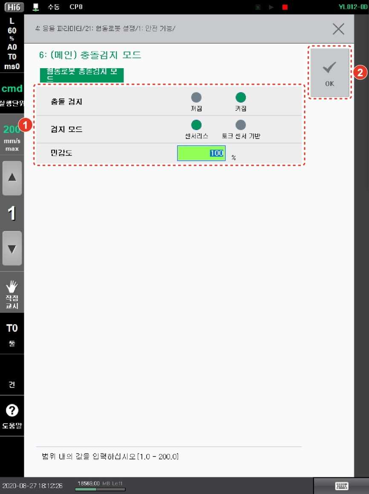

# 1.11 협동로봇 충돌검지 모드

로봇이 비정상적인 조건에서 동작하게 되거나 이상 동작하게 될 때의 안전 장치로 충돌검지 기능이 있습니다. 검지 모드를 설정하고 민감도를 설정하여 충돌에 대한 반응성을 조절할 수 있습니다.

1.  운전 방식을 수동 모드로 설정하십시오.

2.  **\[설정]** 버튼 > **\[4: 응용 파라미터 > 21: 협동로봇 설정 > 1: 안전 기능 > 6: (메인) 충돌검지 모드]** 메뉴를 터치하십시오.

3. 협동로봇의 충돌검지 기능의 사용 여부와 옵션을 설정한 후 **\[OK]** 버튼을 터치하십시오.

* **\[충돌 검지]**: 충돌검지 기능의 사용 여부를 설정합니다.
* **\[검지 모드]**: 충돌검지 시의 검지 모드를 선택합니다.
* **\[민감도]**: 충돌검지 민감도를 설정합니다. 값이 클수록 충격에 민감하게 동작합니다.


**\[주의]**

* 툴 데이터가 실제 값과 오차가 클 경우 충돌을 잘못 검지할 수 있습니다. 길이나 무게, 무게 중심 등의 툴 관련 정보를 정확하게 설정하십시오. 또한 로봇의 설치 각도 및 중력 방향을 반드시 확인하십시오. 툴 데이터를 정확히 설정해도 오검지가 발생한다면 엔코더와 토크센서를 점검하십시오.
* 충돌검지 민감도 값을 지나치게 크게 설정할 경우 오검지가 발생할 수 있습니다. 작업자의 안전을 확보할 수 있도록 적절한 값으로 민감도를 설정하십시오.

