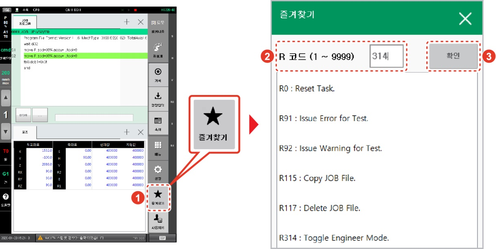
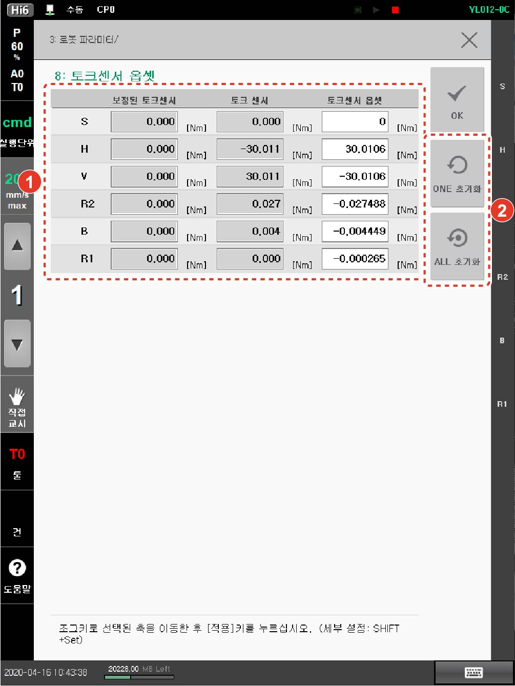

# 1.5.2.1 토크센서 옵셋

1\. 스텝 위치를 기록 및 변경 후 프로그램을 실행하여 로봇의 각 축이 중력의 영향을 받지 않는 자세로 축을 이동하십시오

안전 기능 위반으로 정지 발생 시 복구 모드 상태에서 조그로 각 축을 이동시키십시오. 복구 모드에 대한 자세한 내용은 “[**1.10.5복구 모드**](../../1-10-safety-condition-monitoring/5-recovery-mode/)”를 참조하십시오.


스텝의 위치 기록 및 변경에 대한 자세한 내용은 “[**Hi6 제어기 조작 설명서**](https://hyundai-robotics.gitbook.io/hi6-operation-manual)”의 “[**2.3.2 스텝 위치 기록 및 변경**](https://hyundai-robotics.gitbook.io/hi6-operation-manual/2-operation/2-3-step/step-pose-modify)”을 참고하십시오.


2\. Hi6 티치 펜던트 화면 우측 하단의 **\[즐겨찾기]** 버튼을 터치한 후 즐겨찾기 창의 입력 영역에 314를 입력하고 **\[확인]** 버튼을 터치하십시오.


**\[주의]**

* 엔지니어 모드(Engineer Mode)에서는 상태 표시줄에 엔지니어 모드 아이콘  ()이 깜빡입니다.
* 엔지니어 모드에서 잘못 설정하면 로봇 시스템에 심각한 문제가 발생할 수 있으므로 주의하시기 바랍니다.


3\. **\[설정]** 버튼 > **\[3: 로봇 파라미터 > 8: 토크센서 옵셋]** 메뉴를 터치하십시오.

4\. 각 축의 위치를 확인하고 **\[ONE 초기화]** 또는 **\[All 초기화]** 버튼을 터치하여 토크센서 옵셋값이 변경되는지 확인하십시오.

* 축별로 설정하려면, **\[ONE 초기화]** 버튼을 터치하십시오.
* 모든 축을 한 번에 설정하려면, **\[ALL 초기화]** 버튼을 터치하십시오.

5\. 보정된 토크센서 데이터값이 **0**에 가까운지 확인한 후 **\[OK]** 버튼을 터치하여 저장하십시오.

6\. 시스템을 재부팅하십시오.
