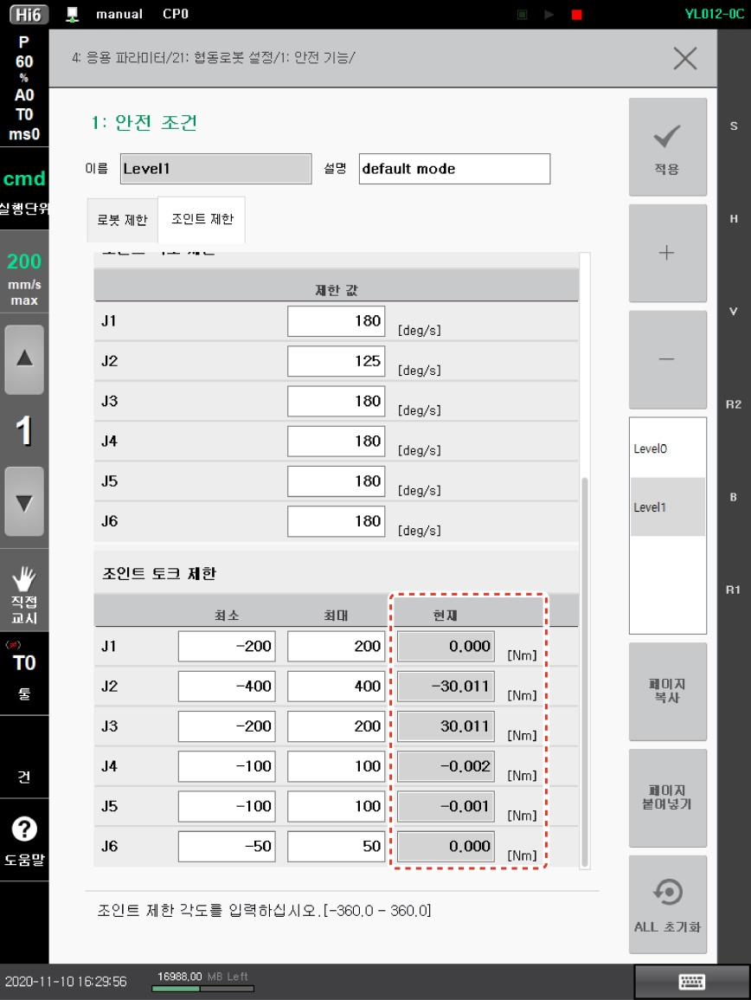

# 1.5.2 토크센서 점검

협동로봇의 안전 기능 중 힘/동력에 대한 진단은 각 축에 부착된 토크센서를 기반으로 수행하므로 토크센서 옵셋이 반드시 수행되어야 합니다. 로봇 출하 시 토크센서 옵셋을 수행하지만 이 값이 정확하지 않은 경우 토크센서 옵셋을 수행해야 합니다.

1\. 스텝 위치를 기록 및 변경 후 프로그램을 실행하여 로봇의 각 축이 중력의 영향을 받지 않는 자세(**0, 90 -90, 90, 0, 0** \[deg])로 축을 이동하십시오.

*   중력의 영향을 받지 않는 자세는 설치 각도에 따라 달라집니다.

    지면과 수평한 방향으로 설치한 경우 중력의 영향을 받지 않는 자세는(**0, 90, -90, 90, 0, 0** \[deg])입니다. 설치 각도가 이와 다른 경우에는 Lower frame이 경사의 방향과 동일하도록 1축의 각도를 변경해야 합니다.

![그림 1 지면 설치 시 로봇 자세(0, 90, -90, 90, 0, 0\[deg\])](../../../_assets/image.png)

![그림 2 벽면 설치 시 로봇 자세(90, 90, -90, 90, 0, 0\[deg\])](<../../../_assets/image_1.png>)

* 안전 기능 위반으로 정지 발생 시 복구 모드 상태에서 조그로 각 축을 이동시키십시오. 복구 모드에 대한 자세한 내용은 “[**1.10.5 복구 모드**](../../1-10-safety-condition-monitoring/5-recovery-mode/)”를 참조하십시오.


스텝의 위치 기록 및 변경에 대한 자세한 내용은 “[Hi6 제어기 조작 설명서](https://hyundai-robotics.gitbook.io/hi6-operation-manual/v/op-english/)”의 “[2.3.2 스텝 위치 기록 및 변경](https://hyundai-robotics.gitbook.io/hi6-operation-manual/2-operation/2-3-step/step-pose-modify)”을 참고하십시오.


2\. **\[설정 > 4: 응용 파라미터 > 21: 협동로봇 설정 > 1: 안전 기능 > 1: 안전 조건]** 메뉴의 **\[조인트 제한]** 탭에서 조인트 토크 제한의 현재 값을 확인하십시오.

3\. 현재 토크센서 데이터값이 절대값 1보다 작으면 메뉴를 종료하고, 데이터값이 절대값 1보다 크면 토크센서 옵셋을 수행하십시오.
