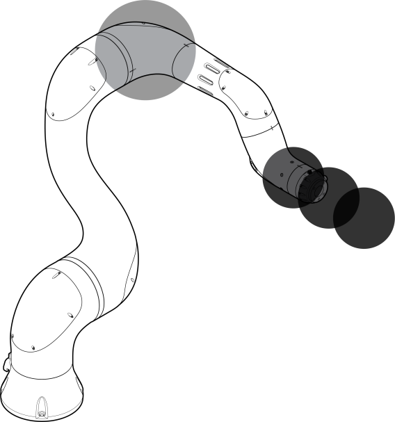
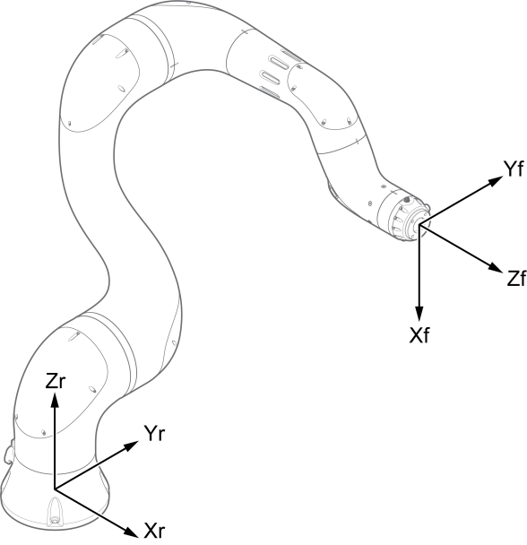
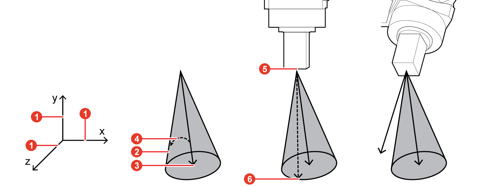

# 1.7.2 Safety tool modeling

Safety space monitoring detects whether the tool modeled in spheres intrudes into the safety spaces or exceeds the working space. You can set up to 16 safety tools and model a safety tool with a maximum of 6 spheres.

Because a safety tool is enabled by a number that is set on the teach pendant, you should model a safety tool based on the tool data set in the **\[Setting > 3: Robot parameter > 1: Tool data**] menu. Refer to the TCP position information displayed at the top of the tool data setting window.

Each sphere used for safety tool modeling is set by its center and radius. Set the center position of the sphere for the modeling based on the robot flange coordinate system (Xf, Yf, and Zf), and set the radius of the sphere, including the tool size and the stopping distance, at the maximum TCP speed.

To use the TCP orientation limiting function in safety tool modeling, you can set cones for monitoring by setting rotation and deviation angles in creating the reference vector.

You can model a cone () that is formed with generator lines spread by the deviation angle () from the reference vector (), which is set by the rotation of the Z-direction vector of the robot coordinate system () at a specified angle. The vertex () of the cone is located at the TCP, and if the Z-direction vector () of the TCP exceeds the monitoring cone, a violation error of the TCP position limiting function will occur.

_assets

You can set parameter values by clicking the **\[Tool]** button in the **\[Set up > 4: Application parameter > 21: Cobot Setup > 1: Cobot Safety Function > 2: Safety layout]** menu.
_assets

_assets


If you use the **\[Copy TCP]** button, the rotational angle values that can be set as the Z-direction vector of the current TCP will be applied to the reference vector, which facilitates the setting of the reference vector.



**\[Caution]**

* Before changing a tool data, check if the parameters set in the tool modeling are correct. The tool data number and the safety tool modeling number of a tool should be equal to each other.
* Because the definition of a robot layout setting applies to the elbow, the other parts of the robot may intrude into a safety space even if a safety space is set.

