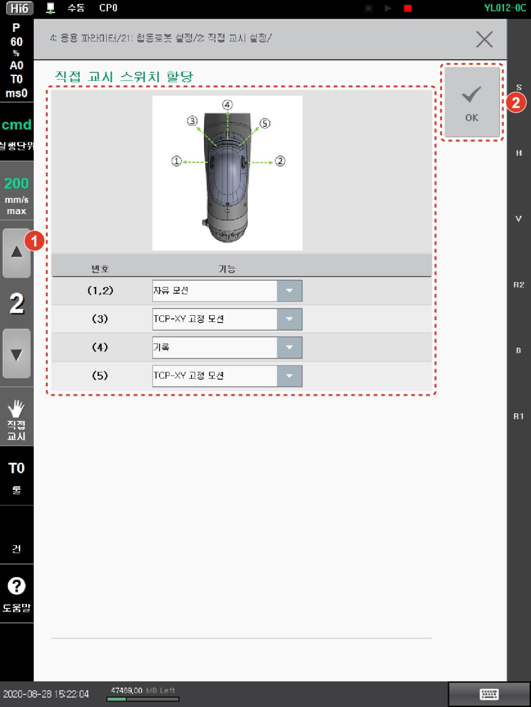
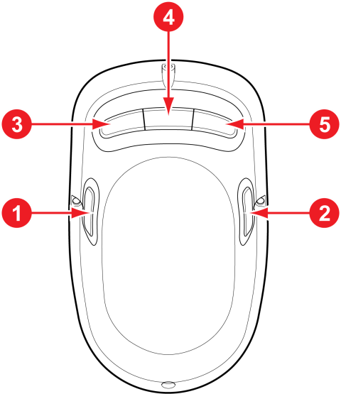

# 2.1 직접 교시 스위치 설정

로봇 본체에 부착된 교시 장치의 스위치를 설정하는 방법은 다음과 같습니다.

1.  **\[설정]** 버튼 > **\[4: 응용 파라미터 > 21: 협동로봇 설정 > 2: 직접 교시 설정 > 1: 직접 교시 스위치 할당]** 메뉴를 터치하십시오.

2. 드롭다운 메뉴를 터치하여 스위치별 기능을 설정한 후 **\[OK]** 버튼을 터치하십시오.

* 직접 교시 스위치별 할당 기능 정보는 다음과 같습니다.

|                            **번호**                            | 　　　　　　　　　　**기능**                                                                                                                                                                         |
| :----------------------------------------------------------: | ---------------------------------------------------------------------------------------------------------------------------------------------------------------------------------------- |
| /  | 자유 모션: 모든 방향으로 이동합니다. (고정)                                                                                                                                                               |
| /  | 
구속 모션: 스위치에 지정한 방향으로만 이동합니다.
<ul><li>툴 좌표계 기준 X, Y 방향(XY 평면)</li><li>툴 좌표계 Z 방향</li><li>툴 좌표계 기준 각 고정: 전 방향 이동(RX, RY, RZ 각도 제한)</li><li>툴 좌표계 기준 점 고정(위치 고정): 각도만 변경 가능</li></ul> |
|                                 | 위치를 기록합니다. (고정)                                                                                                                                                                          |
