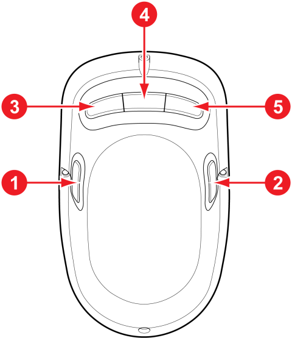

# 2.1 Direct teaching switch assignment

The method for setting the switches of the teaching device attached to the robot manipulator is as follows:

1.  Select the **\[Configure]** button > **\[4: Application parameter > 21: Cobot Setup > 2: Direct Teaching Setup > 1: Direct Teaching Constrained Motion]** menu.

2. Click the drop-down menu, set functions for the switches, and click the **\[OK]** button.

.png>)

The functions that can be assigned to the direct teaching switches are as follows:

|                             No.                             | Function                                                                                                                                                                                                                                                                                                                                                                                                                                   |
| :---------------------------------------------------------: | ------------------------------------------------------------------------------------------------------------------------------------------------------------------------------------------------------------------------------------------------------------------------------------------------------------------------------------------------------------------------------------------------------------------------------------------ |
|                           **No.**                           | 　　　　　　　　　　**Function**                                                                                                                                                                                                                                                                                                                                                                                                                     |
| / | Free motion: The axes move in all directions (fixed).                                                                                                                                                                                                                                                                                                                                                                                      |
| / | 
Constraint motion: The axes move only in the assigned directions.
<ul><li>X and Y directions based on the tool coordinate system (XY plane)</li><li>Z direction on the tool coordinate system</li><li>Angles fixed based on the tool coordinate system: Motion in all directions (RX, RY, and RZ angles are restricted.)</li><li>Points (positions) fixed based on the tool coordinate system: Only angles can be changed.</li></ul> |
|                                | Record positions (fixed).                                                                                                                                                                                                                                                                                                                                                                                                                  |
