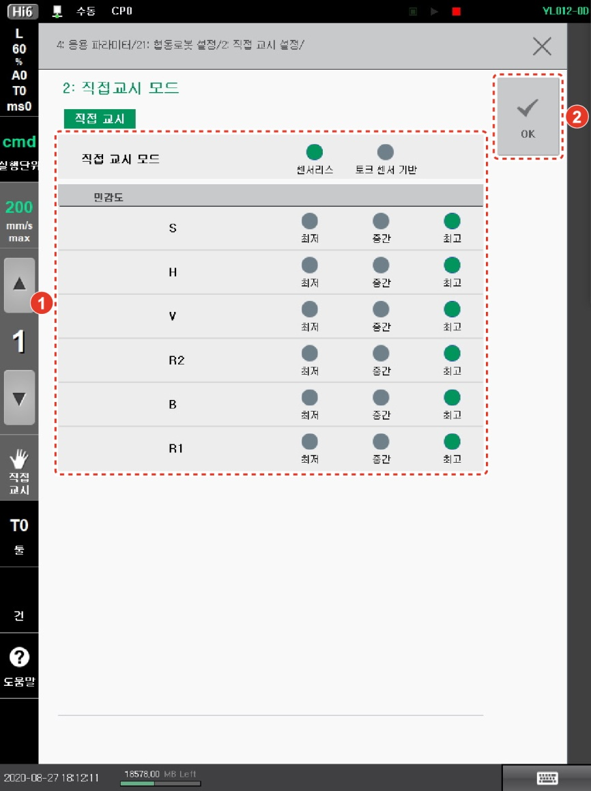

# 2.3 직접 교시 모드 설정

직접 교시에는 센서리스 모드와 토크 센서 기반 모드를 지원합니다.

원하는 직접 교시 모드를 선택하고 축별 민감도를 설정할 수 있습니다. 민감도가 높을수록 더 적은 힘으로 로봇을 움직일 수 있습니다.

1.  운전 방식을 수동 모드로 설정하십시오.

2.  **\[설정]** 버튼 > **\[4: 응용 파라미터 > 21: 협동로봇 설정 > 2: 직접 교시 설정 > 2: 직접교시 모드]** 메뉴를 터치하십시오.

3. 직접 교시 모드를 선택하고 각 축의 민감도를 설정한 후 **\[OK]** 버튼을 터치하십시오.

