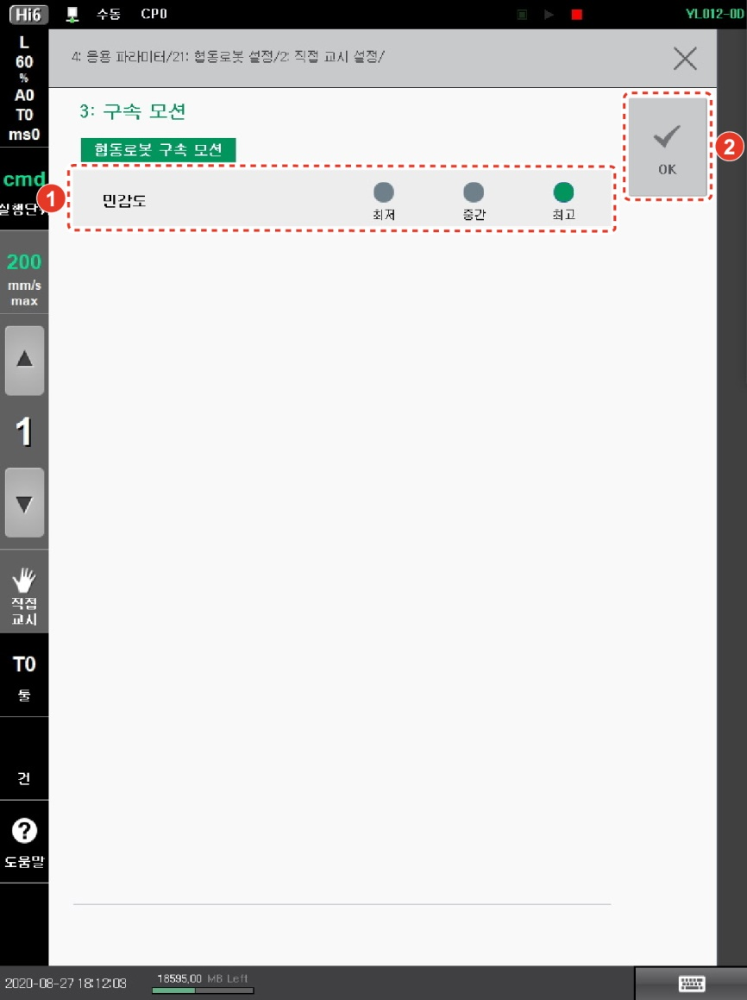

# 2.4 구속 모션 설정

직접 교시를 구속 모션으로 수행할 때 구속 모션의 민감도를 별도로 설정할 수 있습니다. 민감도가 높을수록 더 적은 힘으로 로봇을 움직일 수 있습니다.

1.  운전 방식을 수동 모드로 설정하십시오.

2.  **\[설정]** 버튼 > **\[4: 응용 파라미터 > 21: 협동로봇 설정 > 2: 직접 교시 설정 > 3: 구속 모션]** 메뉴를 터치하십시오.

3. 민감도를 선택한 후 **\[OK]** 버튼을 터치하십시오.


