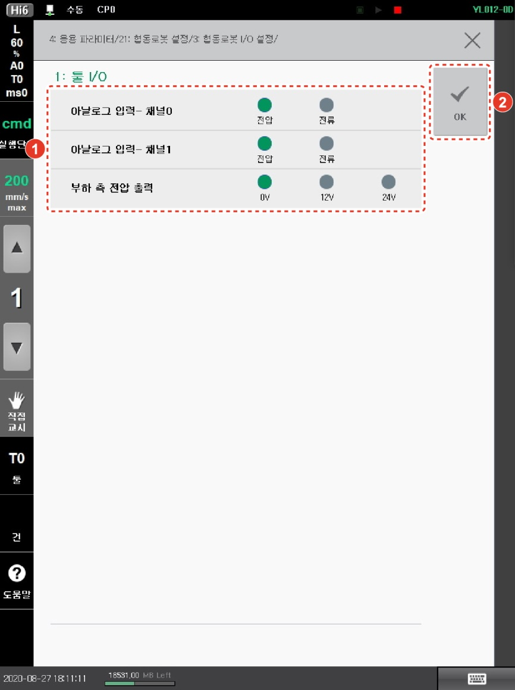

# 3.2.2 툴 I/O 설정

1.  **\[설정]** 버튼 > **\[4: 응용 파라미터 > 21: 협동로봇 설정 > 3: 협동로봇 I/O 설정 > 1: 툴 I/O]** 메뉴를 터치하십시오.

2. 입출력 전압 및 전류를 설정한 후 **\[OK]** 버튼을 터치하십시오.

* **\[아날로그 입력]**: 2 개의 채널의 전압 입력과 전류 입력을 선택합니다.
* **\[부하 측 전압 출력]**: 0V (off), 12V, 24V 중 하나를 선택합니다. 설정값은 전원을 재투입해도 유지됩니다.
