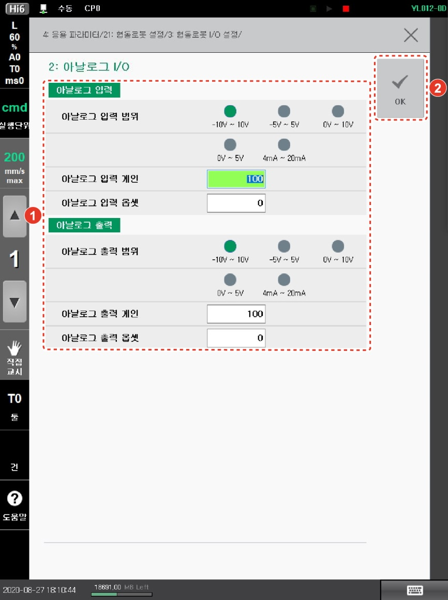

# 3.3.2 아날로그 I/O 설정

1.  **\[설정]** 버튼 > **\[4: 응용 파라미터 > 21: 협동로봇 설정 > 3: 협동로봇 I/O 설정 > 2: 아날로그 I/O]** 메뉴를 터치하십시오.

2. 입출력 전압과 전류, 게인 및 오프셋을 설정한 후 **\[OK]** 버튼을 터치하십시오.

* **\[아날로그 입력/출력 범위]**: 아날로그 입출력 채널의 전압 또는 전류 범위를 선택합니다.
* **\[아날로그 입력/출력 게인]**: 아날로그 입출력 게인을 설정합니다. (단위: %)
* **\[아날로그 입력/출력 옵셋]**: 아날로그 입출력 오프셋을 설정합니다. (단위: Mv 또는 uA)


전압 및 전류의 설정값은 제어기를 재부팅해야 시스템에 적용됩니다.

